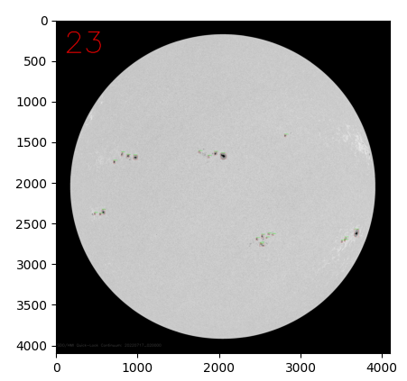
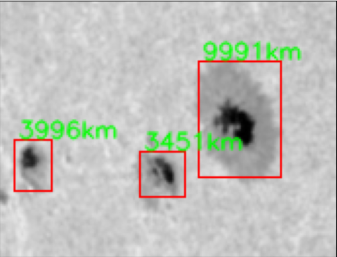

# Find Sunspots

Sunspots are phenomena on the Sun's photosphere that appear 
as temporary spots that are darker than the surrounding areas. 
They are regions of reduced surface temperature caused by 
concentrations of magnetic flux that inhibit convection. [Wikipedia]

This code finds and marks the sunspots from a sun image of a specific
day and counts them. In addition, for each sunspot, its size is estimated.

The image to be analyzed is retrieved from [spaceweather]('http://spaceweather.com/')

## How to Use
Pick a date and insert it to the _date_ variable in the format of (day, month, year) inside the findSunSpot.py file 